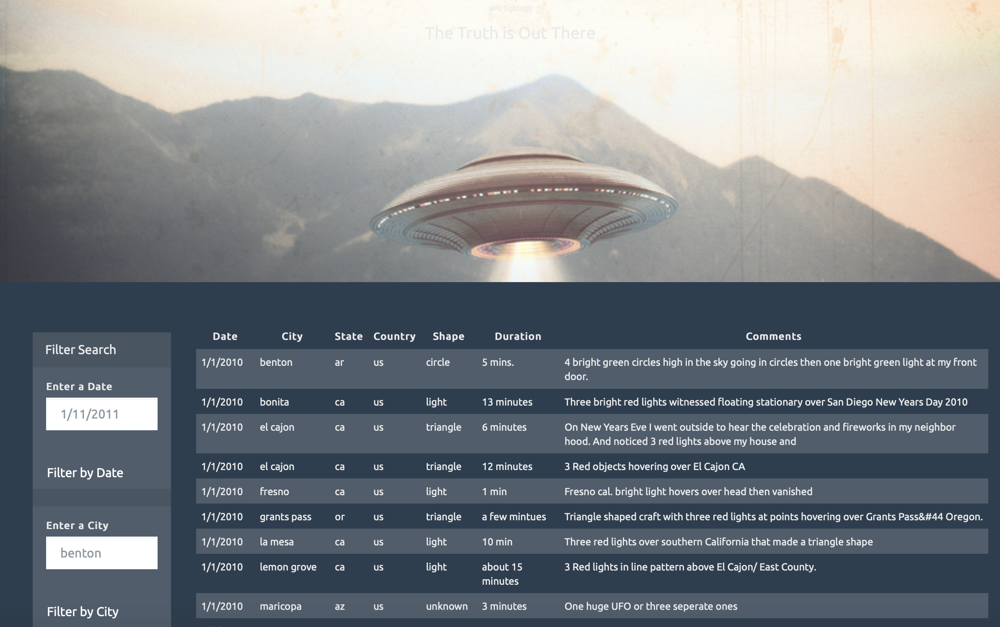
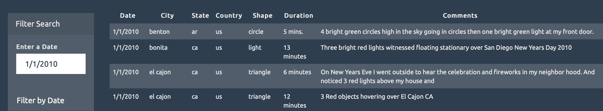
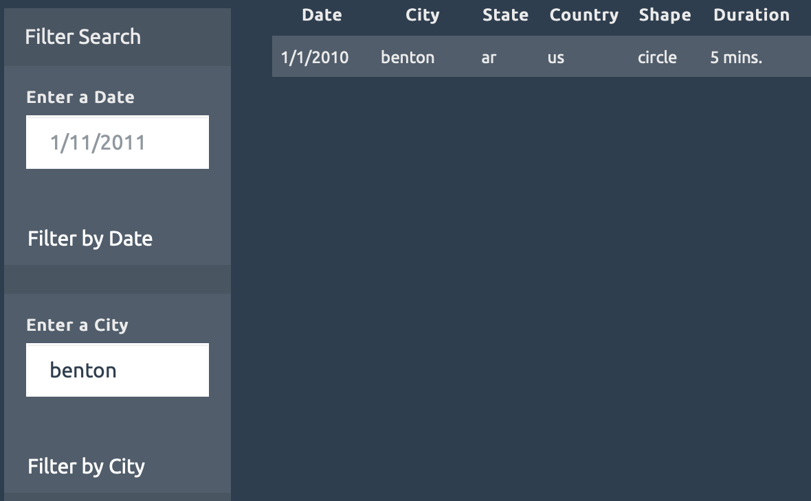

# JavaScript Challenge

## Overview:
In this assignment, an HTML page containing a dynamic table that displays UFO data was created. The table can be filtered by different criteria, and was created using JavaScript, HTML/CSS, and D3.

## Dataset:
the UFO dataset was provided in the form of an array of JavaScript objects, containing the date, city, state, country, shape, duration in minutes, and comment for each sighting,

## Workflow:
JavaScript and D3 were used to read the data.js file and create a table in which new rows of data for each UFO sighting. D3 was also used to filter the table by specific values. The UFO-level-2 folder contains the complete code that allows the table to be filtered by different criteria.

- The table can be filtered by date:

- The table can be filtered by city:

- The table can be also be filtered by state, country and shape of UFO.